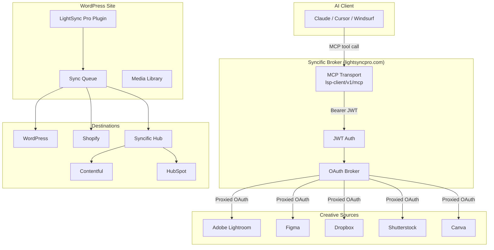
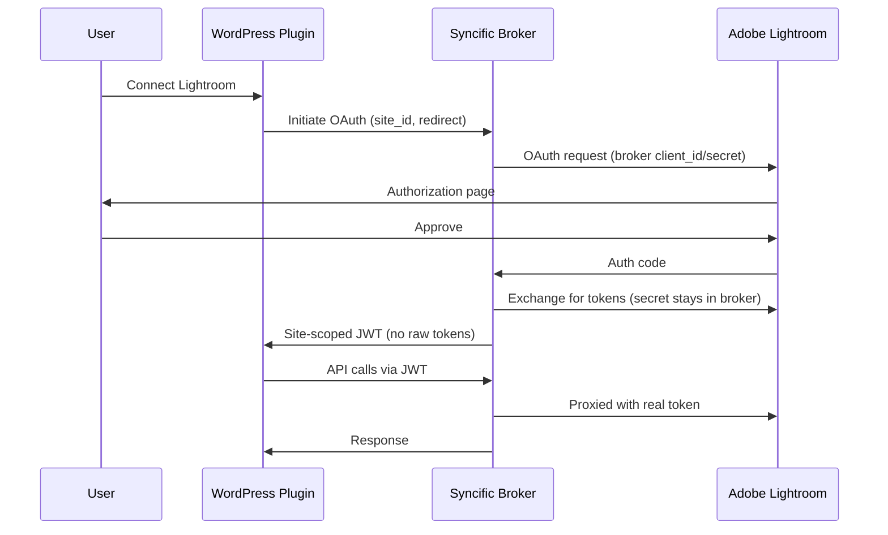
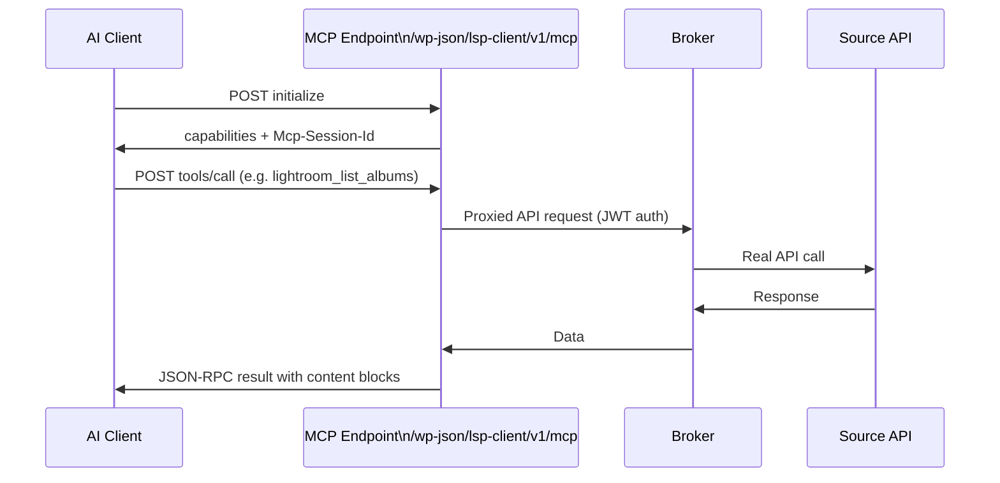
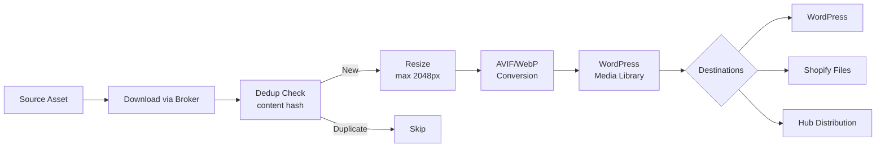
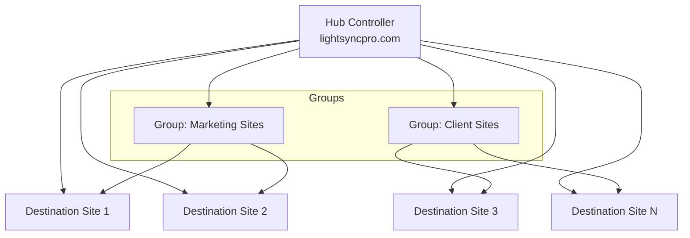

# Architecture

LightSync Pro MCP exposes your creative asset pipeline as an AI-native interface. This document explains the key architectural layers.

---

## Overview

---

## The Broker Architecture

The core innovation (Patent Application 19/440,404) is that **OAuth client secrets are held centrally in the broker**, not distributed with WordPress plugins.

This solves a fundamental problem: WordPress plugins can't safely hold OAuth secrets for cloud APIs like Adobe Lightroom. Anyone who installs the plugin would have access to the credentials — a critical security and compliance issue that prevents legitimate Adobe API approval at scale.

The plugin never sees the OAuth access token. It only holds a site-scoped JWT that the broker validates on each call.

---

## MCP Transport

The MCP server runs directly on the WordPress site under `lsp-client/v1/mcp`. It supports both:

- **Streamable HTTP** (POST with JSON-RPC → JSON-RPC response) — preferred for Claude.ai and modern clients
- **SSE legacy** (GET → event stream, POST /message) — for Claude Desktop and older clients

---

## Tool Tiers

Tools are ordered by load priority to stay within Claude.ai's ~35-tool limit per session:

| Tier | Tools |
|------|-------|
| 1 — Connection | `syncific_status`, `syncific_connect` |
| 2 — Browse | `lightroom_list_albums`, `figma_list_files`, `dropbox_list_files`, etc. |
| 3 — Sync & Import | `sync_source`, `bulk_import`, `sync_info` |
| 4 — Media Management | `media_library`, `media_manage`, `site_health` |
| 5 — AI & Generation | `ai_generate_image`, `ai_generate_text`, `ai_insights` |
| 6 — Destinations | `shopify_upload_file`, `hub`, `version_test` |
| 7 — Config & Reporting | `site_config`, `reports`, `propose_action` |

---

## Data Flow: Sync Pipeline

---

## Multi-Site Hub

The Syncific Hub extends the architecture to enterprise multi-site setups. A single hub controller site distributes assets to N destination sites, each running a lightweight receiver plugin.

